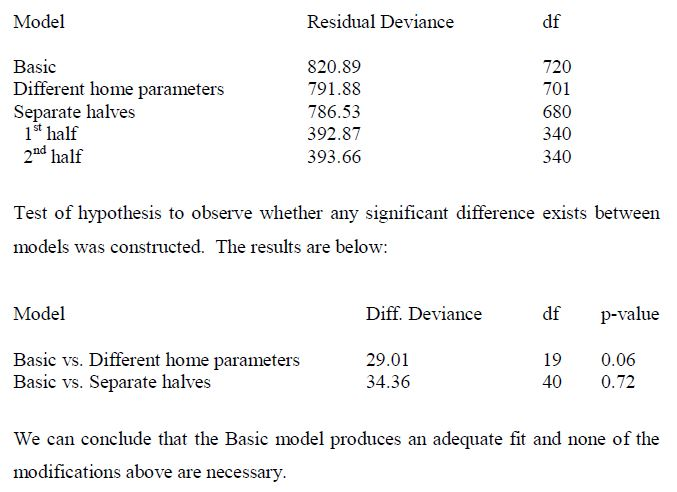

```{r libs, message = FALSE, warning = FALSE, cache = TRUE, include = FALSE}
## Setup Options, Loading Required Libraries and Preparing Environment
## Loading the packages and setting adjustment
suppressMessages(library('utils'))
suppressMessages(source('function/libs.R'))
```

# Abstract

  This is an academic research by apply R statistics analysis to an agency A of an existing betting consultancy firm A. According to the *Dixon and Pope (2004)*^[Kindly refer to 24th paper in [Reference for industry knowdelege and academic research portion for the paper.] in **7.4 References**], due to business confidential and privacy I am also using agency A and firm A in this paper. **The purpose of the anaysis is measure the staking model of the firm A**. For more sample which using R for Soccer Betting see <http://rpubs.com/englianhu>. Here is the references of [rmarkdown](http://rmarkdown.rstudio.com/authoring_basics.html) and [An Introduction to R Markdown](http://rpubs.com/mansun_kuo/24330). You are welcome to read the *Tony Hirst (2014)*^[Kindly refer to 1st paper in [Reference for technical research on programming and coding portion for the paper.] in **7.4 References**] if you are getting interest to write a data analysis on Sports-book.

# [1. Introduction to the Betting Stategics](http://rstudio-pubs-static.s3.amazonaws.com/208637_3c45a2408ed94b9e8620b01714a4af41.html#introduction-to-the-betting-stategics)

  - Section [1.1 Introducing Betting Strategies](http://rstudio-pubs-static.s3.amazonaws.com/208637_8bb1bbc4930a4a22bf579a9b205eaea5.html#introducing-betting-strategies) - Introduce Betting Strategies
  - Section [1.2 Value Betting](http://rstudio-pubs-static.s3.amazonaws.com/208637_8bb1bbc4930a4a22bf579a9b205eaea5.html#value-betting) - Odds Price and Overrounds Changared by Bookmakers
  - Section [1.3 Professional Gambler](http://rstudio-pubs-static.s3.amazonaws.com/208637_8bb1bbc4930a4a22bf579a9b205eaea5.html#professional-gambler) - Punters' life and How Hedge Fund Works

# [2. Data](http://rstudio-pubs-static.s3.amazonaws.com/208637_8bb1bbc4930a4a22bf579a9b205eaea5.html#data)

  - Section [2.1 Collect and Reprocess the Data](http://rstudio-pubs-static.s3.amazonaws.com/208637_8bb1bbc4930a4a22bf579a9b205eaea5.html#collect-and-reprocess-the-data) - Data from Firm A
  - Section [2.2 Overrounds / Vigorish](http://rstudio-pubs-static.s3.amazonaws.com/208637_8bb1bbc4930a4a22bf579a9b205eaea5.html#overrounds-vigorish) - Odds Price and Overrounds Changared by Bookmakers

```{r read-data-summary-table, message = FALSE, warning = FALSE, echo = FALSE, results = 'asis'}
## Load package again due to unable find function
suppressMessages(require('magrittr', quietly = TRUE))

## Read the data
## Refer to **Testing efficiency of coding.Rmd** at chunk `get-data-summary-table-2.1`
years <- seq(2011, 2015)

## Here I take the majority leagues setting profile which are "league-10-12"
## fMYPriceB = Back with vigorish price; fMYPriceL = Lay with vigorish price
## Here we term as Fair Odds
lProfile <- c(AH = 0.10, OU = 0.12)

mbase <- readfirmData(years = years, pth = './data/') %>% arrfirmData(lProfile = lProfile)

## In order to analyse the AHOU, here I need to filter out all soccer matches other than AHOU. (For example : Corners, Total League Goals etc.)
## the stakes amount display as $1 = $10,000
#'@ mbase$datasets[!(mbase$datasets$Home %in% mbase$corners)|!(mbase$datasets$Away %in% mbase$corners),]
dat <- mbase$datasets %>% filter((!Home %in% mbase$others)|(!Away %in% mbase$others)) %>% mutate(Stakes = Stakes/10000, Return = Return/10000, PL = PL/10000)
```

```{r scrap-data, message = FALSE, warning = FALSE, echo = FALSE, results = 'asis'}
## Scrape the leagues and also overrounds which provides by a sportsbookmaker named Firm B
#'@ lnk <- 'http://data.nowgoal.com/history/handicap.htm'
## Above website provides odds price history but sendkeyElements cannot work in RSelenium, will follow-up
## https://github.com/ropensci/RSelenium/issues/55
## Therefore scrape spbo link to know the league of matches

## Besides, need to scrap the final-scores / half-time scores / result of soccer matches
#'@ dateID <- sort(unique(mbase$datasets$Date)); spboDate <- gsub('-','',dateID)
#'@ lnk <- paste0('http://www8.spbo.com/history.plex?day=', spboDate, '&l=en')
## kick-off time(GMT+8) - 12hrs since livescore website start count a day from 12pm(GMT+8)
dateID <- as.Date(sort(unique(dat$Date) - hm('12:00'))); spboDate <- gsub('-', '', dateID)

## Due to the scrapSPBO function scrapped unmatched data, example lnk[827],
##  therefore I rewrite the function as scrapSPBO2
#'@ suppressAll(source('function/scrapSPBO2.R'))
#'@ scrapSPBO2(lnk = lnk, dateID = dateID, path = 'livescore', parallel = TRUE)

## Read spbo livescore datasets.
spboData <- suppressAll(readSPBO(dateID = dateID, parallel = FALSE)$data)

## Apply stringdist() to 'exactly matching' and 'approximate matching' team names
#'@ method <- c('osa', 'lv', 'dl', 'hamming', 'lcs', 'qgram', 'cosine', 'jaccard', 'jw', 'soundex')
#'@ source(paste0(getwd(),'/function/arrTeamID.R'))
#'@ tmID <- arrTeamID(mbase, spboData, parallel = FALSE)
tmIDdata <- read.csv('./data/teamID.csv', header = TRUE, sep = ',') %>% mutate_each(funs(as.character)) %>% data.frame %>% tbl_df %>% filter(spbo != 'Kuban Krasnodar')
spboData %<>% filter((Home %in% tmIDdata$spbo)|(Away %in% tmIDdata$spbo))

rm(dateID, spboDate, readSPBO)
```

# [3. Summarise the Staking Model](http://rstudio-pubs-static.s3.amazonaws.com/208637_8bb1bbc4930a4a22bf579a9b205eaea5.html#summarise-the-staking-model)

  - Section [3.1 Summarise Diversified Periodic Stakes](http://rstudio-pubs-static.s3.amazonaws.com/208637_8bb1bbc4930a4a22bf579a9b205eaea5.html#summarise-diversified-periodic-stakes) - Summarise the Stakes and Return
  - Section [3.2 Summarise the Staking Handicap](http://rstudio-pubs-static.s3.amazonaws.com/208637_8bb1bbc4930a4a22bf579a9b205eaea5.html#summarise-the-staking-handicap) - Summarise the Staking Handicap Breakdown
  - Section [3.3 Summarise the Staking Prices](http://rstudio-pubs-static.s3.amazonaws.com/208637_8bb1bbc4930a4a22bf579a9b205eaea5.html#summarise-the-staking-prices) - Summarise the Staking Price Range Breakdown
  - Section [3.4 Summarise the In-Play Staking Timing](http://rstudio-pubs-static.s3.amazonaws.com/208637_8bb1bbc4930a4a22bf579a9b205eaea5.html#summarise-the-in-play-staking-timing) - Summarise the In-Play Staking Breakdown by Time Range
  - Section [3.5 Summarise the In-Play Staking Based on Current Score](http://rstudio-pubs-static.s3.amazonaws.com/208637_8bb1bbc4930a4a22bf579a9b205eaea5.html#summarise-the-in-play-staking-based-on-current-score) - Summarise the In-Play Staking Breakdown by Current Score

# 4. Staking Ⓜodel

  - Section [4.1 Basic Equation] - Analyse the Odds Price and Probabilities
  - Section [4.2 Linear Ⓜodel] - Reversed Engineer to get the EMOdds derived from Stakes
  - Section [4.3 Kelly Ⓜodel] - Test the Kelly Model.
  - Section [4.4 Poisson Ⓜodel] - Soccer Scores, Odds Price and Stakes modelling.
  - Section [4.5 Staking Ⓜodel and Ⓜoney Ⓜanagement] - Simulate the staking model.
  - Section [4.6 Expectation Ⓜaximization and Staking Simulation] - Enhance by weighted function on Staking model and Simulation.

## 4.1 Basic Equation

  Before we start modelling, we look at the summary of investment return rates.

```{r data-return-summary-table1, echo = FALSE, results = 'asis'}
## Load package again due to cannot find the function
suppressMessages(require('formattable', quietly = TRUE))

## Get the investment return rates per annun
## http://www.math.ku.dk/~rolf/teaching/thesis/DixonColes.pdf
## value rRates is based on annual EMProb/netProb ratio, while EMProb get from equation 4.1.2
m <- ddply(dat, .(Sess), summarise, Stakes = sum(Stakes), Return = sum(Return), n = length(Sess), rRates = Return / Stakes)

m %>% formattable(list(
  Stakes = color_tile('white', 'darkgoldenrod'),
  Return = formatter('span', 
                     style = x ~ style(color = ifelse(rank(-x) <= 3, 'green', 'gray')), x ~ sprintf('%.2f (rank: %02d)', x, rank(-x))),
  n = color_tile('white', '#9B870C'),
  rRates = formatter('span', 
                     style = x ~ style(color = ifelse(rank(-x) <= 3, 'green', 'gray')), x ~ sprintf('%.2f (rank: %02d)', x, rank(-x)))
)) %>% as.htmlwidget
```

*table 4.1.1* : `r paste0(dim(m), collapse=' x ')` : *Return of annually investment summary table.*^[Kindly refer to the list of colors via [Dark yellow with hexadecimal color code #9B870C](http://encycolorpedia.com/9b870c) for plot the stylist table.]

$$\Re = \sum_{i=1}^{n}\rho_{i}^{EM}/\sum_{i=1}^{n}\rho_{i}^{BK} \cdots equation 4.1.1$$

  $\Re$ is the return rates of investment. The $\rho_i^{EM}$ is the estimated probabilities which is the calculated by firm A from match 1,2... until $n$ matches while $\rho_{i}^{BK}$ is the net/pure probability (real odds) offer by bookmakers after we fit the *equation 4.1.2* into *equation 4.1.1*.

$$\rho_i = P_i^{Lay} / (P_i^{Back} + P_i^{Lay}) \cdots equation 4.1.2$$

$P_i^{Back}$ and $P_i^{Lay}$ is the backed and layed fair price offer by bookmakers.

  We can simply apply equation above to get the value $\Re$. From the table above we know that the EMPrice calculated by firm A **invested** at a threshold edge (price greater) `r m$rRates` than the prices offer by bookmakers. There are some description about $\Re$ on *Dixon and Coles (1996)*^[Kindly refer to 25th paper in [Reference for industry knowdelege and academic research portion for the paper.] under **7.4 References**]. The optimal value of $\rho_{i}$ (`rEMProbB`) will be calculated based on bootstrapping/resampling method in section [4.3 Kelly Ⓜodel].

```{r data-prob-table2, echo = FALSE, results = 'asis'}
## http://www.math.ku.dk/~rolf/teaching/thesis/DixonColes.pdf
## value R.rates is based on annual EMProb/netProb ratio, while EMProb get from equation 4.1.2
## Please refer to function arrfirmDatasets()
dat %<>% mutate(rEMProbB = round(unlist(sapply(split(m, m$Sess), function(x) rep(x$rRates, x$n))) * netProbB, 6), rEMProbL = round(1 - rEMProbB, 6))

dat %>% select(No, EUPrice, HKPrice, fHKPriceL, fMYPriceB, fMYPriceL, netProbB, netProbL, rEMProbB, rEMProbL, favNetProb, undNetProb) %>% .[sample(1:nrow(.), 6), ] %>% formattable %>% as.htmlwidget
```

*table 4.1.2* : `r paste0(dim(dat), collapse = ' x ')` : *Odds price and probabilities sample table.*

  Above table list a part of sample odds prices and probabilities of soccer match $i$ while $n$ indicates the number of soccer matches. We can know the values `rEMProbB`, `netProbB` and so forth.

```{r data-prob-plot2, message = FALSE, warning = FALSE, echo = FALSE, results = 'asis'}
## Linear model
## Learn about API authentication here: https://plot.ly/r/getting-started
## Find your api_key here: https://plot.ly/settings/api

#'@ model <- lm(rEMProbB ~ netProbB, data=dat)
#'@ grid <- with(dat, expand.grid(netProbB = seq(min(netProbB), max(netProbB), length = 20),
#'@                                 rEMProbB = seq(min(rEMProbB), max(rEMProbB), length = 20)))
#'@ grid$rEMProb <- stats::predict(model, newdata=grid)
#'@ viz2 <- qplot(netProbB, rEMProbB, data=dat) + geom_point(data=grid)
#'@ out <- ggplotly(viz2)
#'@ plotly_url <- out$response$url

#'@ ggplot(dat, aes(x = netProbB, y = rEMProbB)) + geom_point(aes(y = netProbB, color = 'netProbB')) + geom_point(aes(y = rEMProbB, color = 'rEMProbB')) + xlab('Bookmaker Backed Net Prob') + ylab('Calculated EM Backed Prob') + theme_economist(base_family='Verdana') + scale_colour_economist() + ggtitle('Bookmaker Net Probabilities -vs- Firm A EM Probabilities')

gvis.options <- list(title = "Bookmaker Net Probabilities -vs- Firm A EM Probabilities", series = "[{targetAxisIndex:0},{targetAxisIndex:1}]", hAxis = "{title:'Bookmaker Backed Net Prob'}", vAxis = "{title:'rEMProbB'},{title:'netProbB'}", pointSize = 2, width = 'automatic', height = 'automatic', gvis.editor = 'Edit me!')

#'@ plot4.1.1 <- gvisLineChart(xvar = 'netProbB', yvar = 'rEMProbB', data = dat, options = gvis.options)
plot4.1.1 <- googleVis::gvisScatterChart(dat[c('netProbB', 'rEMProbB')], options = gvis.options)
plot(plot4.1.1)

rm(plot4.1.1)
```

*graph 4.1.1* : *A sample graph about the relationship between the investmental probabilities -vs- bookmakers' probabilities.*

  Graph above shows the probabilities calculated by firm A to back against real probabilities offered by bookmakers over `r nrow(dat)` soccer matches.

  Now we look at the result of the soccer matches.

```{r data-return-summary-table2, echo = FALSE, results = 'asis'}
## http://www.statmethods.net/stats/frequencies.html
## prop.table, margin.table
## margin.table(table(dat$Result), 1)
##
## library('gmodels')
## CrossTable(dat$HCap, dat$Result)
##

m <- ddply(dat, .(Result), summarise, Stakes = sum(Stakes), Return = sum(Return), Rates = Return / Stakes, n = length(Sess)) %>% tbl_df %>% mutate(S.prop = round(Stakes / sum(Stakes), 4), R.prop = round(Return / sum(Return), 4), prop = round(n / sum(n), 4))
tv <- c('Total', colSums(m[-1])); tv[4] <- as.numeric(tv[3]) / as.numeric(tv[2])
m <- suppressWarnings(rbind(m, tv))
m$Result <- factor(c(as.character(m$Result)[-length(m$Result)], 'Total')); rm(tv)
m %<>% purrr::map_if(is.character, as.numeric) %>% data.frame %>% tbl_df
#'@ m %>% kable(caption = 'Table 4.1.3 : Summary of Betting Results')

suppressMessages(library('formattable'))
m %>% formattable(list(
    caption = 'Table 4.1.3 : Summary of Betting Results',
    
    Stakes = formatter('span', style = x ~ style(color = ifelse(rank(-x) <= 3, 'blue', 'grey')), x ~ sprintf('%.2f (rank: %.0f)', x, rank(-x))),
    
    Return = formatter('span', style = x ~ style(color = ifelse(rank(-x) <= 3, 'blue', 'grey')), x ~ sprintf('%.2f (rank: %.0f)', x, rank(-x))),
    
    Rates = formatter('span', style = x ~ style(color = ifelse(rank(-x) <= 3, 'blue', 'grey')), x ~ sprintf('%.4f (rank: %.0f)', x, rank(-x))),
    
    n = color_tile('white', 'green'),
    
    S.prop = formatter('span', style = x ~ style(color = ifelse(rank(-x) <= 3, 'blue', 'grey')), x ~ sprintf('%.4f (rank: %2d)', x, rank(-x))),
    
    R.prop = formatter('span', style = x ~ style(color = ifelse(rank(-x) <= 3, 'blue', 'grey')), x ~ sprintf('%.4f (rank: %.0f)', x, rank(-x))),
    
    prop = formatter('span', style = x ~ style(color = ifelse(rank(-x) <= 3, 'blue', 'grey')), x ~ sprintf('%.4f (rank: %.0f)', x, rank(-x)))
)) %>% as.htmlwidget
```

*table 4.1.3* : `r paste0(dim(m), collapse = ' x ')` : *Summary of betting results.*

  The table above summarize the stakes and return on soccer matches result. Well, below table list the handicaps placed by firm A on agency A. I list the handicap prior to test the coefficient according to the handicap in next section [4.2 Linear Ⓜodel].

```{r data-preMatch, echo = FALSE, results = 'asis'}
##
## Calculate the proportional model on the results, which are 'Cancelled', 'Half-Loss', 'Half-Win', 'Loss', 'Push', 'Win'.
## Ommited the InPlay matches, filter out the sample data, only Pre-Games matches taken into further calculations.
preData <- filter(dat, InPlay == 'No' & InPlay2 == 'No')
hdp <- sort(unique(as.numeric(as.character(dat$HCap))))

hdp %<>% matrix(., ncol = 8, dimnames = list(NULL, c('X350.225',	'X200.075',	'X050.075',	'X100.225',	'X250.375',	'X400.525',	'X550.675',	'X700.825'))) %>% data.frame

hdp %>% formattable(list(
  X350.225 = formatter('span', style = x ~ style(color = ifelse(x > 0, 'green', 'red')), x ~ icontext(ifelse(x > 0, x, -x), ifelse(x, x, x))), 
  X200.075 = formatter('span', style = x ~ style(color = ifelse(x > 0, 'green', 'red')), x ~ icontext(ifelse(x > 0, x, -x), ifelse(x, x, x))), 
  X050.075 = formatter('span', style = x ~ style(color = ifelse(x > 0, 'green', 'red')), x ~ icontext(ifelse(x > 0, x, -x), ifelse(x, x, x))), 
  X100.225 = formatter('span', style = x ~ style(color = ifelse(x > 0, 'green', 'red')), x ~ icontext(ifelse(x > 0, x, -x), ifelse(x, x, x))), 
  X250.375 = formatter('span', style = x ~ style(color = ifelse(x > 0, 'green', 'red')), x ~ icontext(ifelse(x > 0, x, -x), ifelse(x, x, x))), 
  X400.525 = formatter('span', style = x ~ style(color = ifelse(x > 0, 'green', 'red')), x ~ icontext(ifelse(x > 0, x, -x), ifelse(x, x, x))), 
  X550.675 = formatter('span', style = x ~ style(color = ifelse(x > 0, 'green', 'red')), x ~ icontext(ifelse(x > 0, x, -x), ifelse(x, x, x))), 
  X700.825 = formatter('span', style = x ~ style(color = ifelse(x > 0, 'green', 'red')), x ~ icontext(ifelse(x > 0, x, -x), ifelse(x, x, x)))
  )
) %>% as.htmlwidget
```

*table 4.1.4 : `r paste0(dim(hdp), collapse = ' x ')` : The handicap in sample data.*

## 4.2 Linear Ⓜodel

  From our understanding of staking, the covariates we need to consider should be only odds price since the handicap's covariate has settled according to different handicap of EMOdds.

```{r plot4.2.1, echo = FALSE, eval = FALSE, results = 'asis'}
n1 <- rPlot(Return ~ Stakes, data = dat, color = 'Stakes', type = 'point')
n1$addControls('x', value = 'Stakes', values = names(dat))
n1$addControls('y', value = 'Stakes', values = names(dat))
n1$addControls('color', value = 'Stakes', values = names(dat))
#'@ n1$print(include_assets = TRUE)
#'@ 
n1
```

  Again, I don't pretend to know the correct Ⓜodel, here I simply apply linear model to retrieve the value of *EMOdds* derived from stakes. The purpose of measure the edge overcame bookmakers' vigorish is *to know the levarage of the staking activities onto 1 unit edge of odds price by firm A to agency A*.

```{r linear-models, echo = FALSE, results = 'asis'}
## Choosing the variables of linear models
## The net probabilities might open diversified handicap, therefore the HCap parameter need to be insert as one of parameter since the return of draw-no-bet, win-half, win-full, loss-half, loss-full (example : 0, 0/0.5, 0.5, 0.5/1, 1) affect the return of investment.
lm0 <- lm(Return ~ Stakes, data = dat)
lm1 <- lm(Return ~ Stakes + HCap, data = dat)
lm2 <- lm(Return ~ Stakes + netProbB, data = dat)
lm3 <- lm(Return ~ Stakes + HCap + netProbB, data = dat)
lm4 <- lm(Return ~ Stakes + ipRange, data = dat)
lm5 <- lm(Return ~ Stakes + ipHCap, data = dat)
lm6 <- lm(Return ~ Stakes + HCap + ipRange, data = dat)
lm7 <- lm(Return ~ Stakes + CurScore + ipHCap, data = dat)
lm8 <- lm(Return ~ Stakes + CurScore + ipRange, data = dat)
lm9 <- lm(Return ~ Stakes + CurScore + ipRange + ipHCap, data = dat)

## Linear Interative Effect Models
lm10 <- lm(Return ~ HCap + netProbB + HCap:netProbB, data = dat)
lm11 <- lm(Return ~ Stakes + ipHCap + ipRange + ipHCap:ipRange, data = dat)
lm12 <- lm(Return ~ Stakes + CurScore + ipRange + ipHCap + CurScore:ipHCap:ipRange, data = dat)

## Linear Mixed Effects Models
## Mixed effect categorised the parameters by group... similar with current score during living betting modelling, the scoring rate (intensity of scores) during 0-0 is different with scoring rates during 1-0 etc.
lm13 <- lm(Return ~ Stakes + (1|HCap), data = dat)
lm14 <- lm(Return ~ HCap + (1|Stakes), data = dat) # the stakes amount placed by firm A must be based on the degree of the edges to punter. Here I try to test the effect. (Although firm A might bet via several agents, here I can only took available sample from population to test the efficiency.)

lms <- list(lm0 = lm0, lm1 = lm1, lm2 = lm2, lm3 = lm3, lm4 = lm4, lm5 = lm5, lm6 = lm6, lm7 = lm7, lm8 = lm8, lm9 = lm9, lm10 = lm10, lm11 = lm11, lm12 = lm12, lm13 = lm13, lm14 = lm14)
```

<s>
```{r lm-summary, echo = FALSE, eval = FALSE, results = 'asis'}
#'@ anova to compare the models
#'@ anova(lm0, lm1, lm2, lm3, lm4, lm5, lm6, lm7, lm8, lm9, lm10, lm11, lm12, lm13, lm14, test = 'F')

## xtable always shows LaTeX output but not table.
#'@ list(lm0, lm1, lm2, lm3, lm4, lm5, lm6, lm7, lm8, lm9, lm10, lm11, lm12, lm13, lm14) %>% llply(., function(x) print(xtable(x), floating = TRUE, type = 'html'))

#'@ list(lm0, lm1, lm2, lm3, lm4, lm5, lm6, lm7, lm8, lm9, lm10, lm11, lm12, lm13, lm14) %>% llply(., stargazer, type = 'html')
stargazer(lm0, lm1, lm2, lm3, lm4, lm5, lm6, lm7, lm8, lm9, lm10, lm11, lm12, lm13, lm14, type = 'html')

#'@ list(lm0, lm1, lm2, lm3, lm4, lm5, lm6, lm7, lm8, lm9, lm10, lm11, lm12, lm13, lm14) %>% llply(., texreg)
```

*table 4.2.1 : Summary of linear models.*^[Kindly refer to below *shinyapp 4.2.1* as I wrote as an shiny app.]

```{r lm-anova, echo = FALSE, eval = FALSE, results = 'asis'}
## xtable always shows LaTeX output but not table.
#'@ list(lm0, lm1, lm2, lm3, lm4, lm5, lm6, lm7, lm8, lm9, lm10, lm11, lm12, lm13, lm14) %>% llply(., function(x) print(xtable(anova(x)), floating = TRUE, type = 'html'))

#'@ list(lm0, lm1, lm2, lm3, lm4, lm5, lm6, lm7, lm8, lm9, lm10, lm11, lm12, lm13, lm14) %>% llply(., function(x) stargazer(anova(x), type = 'html'))

#'@ stargazer(anova(lm0, lm1, lm2, lm3, lm4, lm5, lm6, lm7, lm8, lm9, lm10, lm11, lm12 lm13, lm14), type = 'html')

stargazer(anova(lm0, lm1, lm2, lm3, lm4), type = 'html')
#'@ list(lm5, lm6, lm7, lm8, lm9, lm10, lm11, lm12) %>% llply(stargazer, anova, type = 'html')
stargazer(anova(lm5), type = 'html')
stargazer(anova(lm6), type = 'html')
stargazer(anova(lm7), type = 'html')
stargazer(anova(lm8), type = 'html')
stargazer(anova(lm9), type = 'html')
stargazer(anova(lm10), type = 'html')
stargazer(anova(lm11), type = 'html')
stargazer(anova(lm12), type = 'html')
stargazer(anova(lm13), type = 'html')
stargazer(anova(lm14), type = 'html')

#'@ list(lm0, lm1, lm2, lm3, lm4, lm5, lm6, lm7, lm8, lm9, lm10, lm11, lm12, lm13, lm14) %>% llply(., function(x) texreg(anova(x)))
```

*table 4.2.2 : Anova of linear models.*^[Kindly refer to below *shinyapp 4.2.1* as I wrote as an shiny app.]
</s>

  When I used to work in 188Bet and Singbet as well as AS3388, we know from the experience which is the odds price of favorite team win will be the standard reference and the draw odds will adjust a little bit while the underdog team will be ignore.

  *Steven Xu (2013)*^[Kindly refer to 16th paper in [Reference for industry knowdelege and academic research portion for the paper.]] has do a case study on the comparison of the efficiency of opening and closing price of NFL and College American Football Leagues and get to know the closing price is more efficient and accurate compare to opening price nowadays compare to years 1980~1990. It might be due to multi-million dollars of stakes from informed traders or smart punters to tune up the closing price to be likelihood.
  
  In order to test the empirical clichés, I used to conduct a research thoroughly through *®γσ, Eng Lian Hu (2016)*^[Kindly refer to 3rd paper in [Reference for industry knowdelege and academic research portion for the paper.] under **7.4 References**, I completed the research on year 2010 but write the thesis in year 2016.] and concludes that the opening price of Asian Handicap and also Goal Lines of 29 bookmakers are efficient than mine. However in my later *®γσ, Eng Lian Hu (2014)*^[Kindly refer to 4th paper in [Reference for industry knowdelege and academic research portion for the paper.] under **7.4 References**] applied Kelly staking model where made a return of more than 30% per sesson. Meanwhile, the *Dixon and Coles (1996)* and *Crowder, Dixon, Ledford and Robinson (2001)*^[Kindly refer to 27th paper in [Reference for industry knowdelege and academic research portion for the paper.] under **7.4 References**] has built two models which compare the accuracy of home win, draw and away win. From a normal Poison model reported the home win is more accurate and therefore an add-hoc inflated parameter required in order to increase the accuracy of prediction. You are feel free to learn about the *Dixon and Coles (1996)* in section [4.4 Poisson Ⓜodel].

  Based on *table 2.2.1* we know about the net bookies probabilities and EM probabilities, here I simply apply *linear regression model*^[You can learn from [Linear Regression in R (R Tutorial 5.1 to 5.11)](https://www.youtube.com/watch?v=66z_MRwtFJM). You can also refer to [Getting Started with Mixed Effect Models in R](http://www.r-bloggers.com/getting-started-with-mixed-effect-models-in-r/), [A very basic tutorial for performing linear mixed effects analyses](https://github.com/scibrokes/betting-strategy-and-model-validation/blob/master/references/A%20Very%20Basic%20Tutorial%20for%20Performing%20Linear%20Mixed%20Effects%20Analyses.pdf) and [Fitting Linear Mixed-Effects Models using lme4](https://github.com/scibrokes/betting-strategy-and-model-validation/blob/master/references/Fitting%20Linear%20Mixed-Effects%20Models%20Using%20lme4.pdf). Otherwise you can read [Linear Models with R](https://github.com/scibrokes/betting-strategy-and-model-validation/blob/master/references/Linear%20Models%20with%20R.pdf) and somemore details about regression models via [Extending the Linear Model with R : Generalized Linear, Mixed Effects and Nonparametric Regression Models](https://github.com/scibrokes/betting-strategy-and-model-validation/blob/master/references/Extending%20the%20Linear%20Model%20with%20R%20-%20Generalized%20Linear%2C%20Mixed%20Effects%20and%20Nonparametric%20Regression%20Models.pdf). Besides, [What statistical analysis should I use?](http://www.ats.ucla.edu/stat/mult_pkg/whatstat/) summarise a table for test analysis and data validation. [Fit models to data](https://www.zoology.ubc.ca/~schluter/R/fit-model/) provides examples for application of linear regression and model selection, the main model-fitting commands covered *lm (linear models for fixed effects)*, *lme (linear models for mixed effects)*, *glm (generalized linear models)*, *nls (nonlinear least squares)*, *gam (generalized additive models)* and also *visreg (to visualize model fits)*. The answer from [How to use R anova() results to select best model?](http://stats.stackexchange.com/questions/172782/how-to-use-r-anova-results-to-select-best-model) eleborates the use of ANOVA and [AIC criterion](https://en.wikipedia.org/wiki/Akaike_information_criterion) to choose the best fit model. [How to Choose the Best Regression Model](http://blog.minitab.com/blog/adventures-in-statistics/how-to-choose-the-best-regression-model) describes how to find the best regresion model to fit and applicable to the real world. [ANOVA - Model Selection
]() summarised a lecture notes in slideshow while [Model Selection in R]() conducts a research on model selection for both nested and non-nested linear models.] and also anova to compare among the models.

^[You might select Y response variable and X explanatory variable(s) to measure your model^[Refer to [Shiny height-weight example](runGist("https://gist.github.com/wch/4034323")) for further information about shinyapp for linear models.] or existing models.] to use the ShinyApp](figure/20160918_163958.gif)

  Here I simply attached with a Fixed Odds to Asian Handicap's calculator which refer to my *ex-colleague William Chen's*^[My ex-colleague and best friend in sportsbook industry which known since join sportsbook industry year 2005 ------ Telebiz and later Caspo Inc.] spreadsheet version 1.1 in year 2006. You can simply input the home win, draw, away win (in decimal format) as well as the overround to get the conversion result from the simple an basic equation.^[Kindly refer to my previous research to know the vigorish / overround.]

  From the summary of *shinyapp 4.2.1*, we know the comparison among the models to get the best fitted model.

```{r comp, echo = FALSE, results = 'asis'}
compare <- ldply(lms, function(x) {
    y <- summary(x)$fstatistic
    df <- data.frame(t(summary(x)$df), 'p.value' = pf(y[1], y[2], y[3], lower.tail = FALSE))
    names(df) <- c('df', 'residuals', 'df', 'p.value'); df}) %>% tbl_df

compare %>% formattable(list(
  df = formatter('span', style = x ~ style(color = ifelse(rank(-x) <= 3, 'blue', 'grey')), x ~ sprintf('%.0f (rank: %02d)', x, rank(-x))),
  
  residuals = formatter('span', style = x ~ style(color = ifelse(rank(-x) <= 3, 'blue', 'grey')), x ~ sprintf('%.0f (rank: %02d)', x, rank(-x))),
  
  p.value = formatter('span', style = x ~ style(color = ifelse(rank(-x) <= 3, 'blue', 'grey')), x ~ sprintf('%.4f (rank: %02d)', x, rank(-x)))
  )) %>% as.htmlwidget
```

  *John Fingleton & Patrick Waldron (1999)* apply Shin's model and finally conclude suggests that bookmakers in Ireland are infinitely risk-averse and balance their books. The authors cannot distinguish between inside information and operating costs, merely concluding that combined they account for up to 3.7% of turnover while normally Asian bookmakers made less than 1% and a anonymous company has made around 2%. However the revenue or the stakes are farly more than European bookmakers.^[You can refer to my another project [Analyse the Finance and Stocks Price of Bookmakers](https://github.com/scibrokes/analyse-the-finance-and-stocks-price-of-bookmakers) which analysis the financial report of public listed companies and also profitable products' revenue and profit & loss of anonymous company.]. 
  
  They compare different versions of our model, using data from races in Ireland in 1993. The authors' empirical results can be summarised as follows:
  
  - They reject the hypothesis that bookmakers behave in a risk neutral manner;
  - They cannot reject the hypothesis that they are infinitely riskaverse;
  - They estimate gross margins to be up to 4 per cent of total oncourse turnover; and
  - They estimate that 3.1 to 3.7% (by value) of all bets are placed by punters with inside information.

  Due to the Shin model inside the paper research for the sake of bookmakers and this sportsbook consultancy firm is indeed the informed trading (means smart punters or actuarial hedge fund but not ordinary gambler place bets with luck). Here I think of test our previous data in paper *®γσ, Eng Lian Hu (2016)*^[Kindly refer to 3rd paper in [Reference for industry knowdelege and academic research portion for the paper.] under **7.4 References** which collect the dataset of opening and also closing odds price of 40 bookmakers and 29 among them with Asian Handicap and Goal Line. Meanwhile, there has another research on smart punters (*Punters Account Review (Agenda).xlsx*) which make million dollars profit from Ladbrokes. You are feel free to browse over the [dataset](https://www.dropbox.com/sh/ifwczokjptt6re0/AADv1VarJoQ6IgIitZBzG5c6a?dl=0) for the paper.] and also the anonymous companies's revenue and P&L to analyse the portion of smart punters among the customers in [Analyse the Finance and Stocks Price of Bookmakers](https://github.com/scibrokes/analyse-the-finance-and-stocks-price-of-bookmakers). However the betslip of every single bet require to analyse it. The sparkR amd RHadoop as well as noSQL require in order to analyse the multiple millions bets. It is interesting to analyse *the threaten of hedge fund*^[Kindly refer to [富传奇色彩的博彩狙击公司EM2](https://englianhu.wordpress.com/sportsbook/%E5%AF%8C%E4%BC%A0%E5%A5%87%E8%89%B2%E5%BD%A9%E7%9A%84%E5%8D%9A%E5%BD%A9%E7%8B%99%E5%87%BB%E5%85%AC%E5%8F%B8em2-expectation-maximization/) to know the history and the threaten of EM2 sportsbook consultancy company to World wide known bankers.] since there has a anonymous brand among the brands under Caspo Inc had closed due to a lot of smart punters' stakes and made loss. Well, here I leave it for future research^[Here I put in [6.2 Future Works].] if the dataset is available.

## 4.3 Kelly Ⓜodel

  From the papers *Niko Marttinen (2001)*^[Kindly refer to 1th paper in [Reference for industry knowdelege and academic research portion for the paper.]] and *Jeffrey Alan Logan Snyder (2013)*^[Kindly refer to 2nd paper in [Reference for industry knowdelege and academic research portion for the paper.] under **7.4 References**] both applying **Full-Kelly**,**Half-Kelly** and also **Quarter-Kelly** models which similar with my previous Kelly-Criterion model *®γσ, Eng Lian Hu 2014*^[Kindly refer to 4th paper in [Reference for industry knowdelege and academic research portion for the paper.] in **7.4 References**] but enhanced.

  To achieve the level of profitable betting, one must develop a correct money management procedure. The aim for a punter is to maximize the winnings and minimize the losses. If the punter is capable of predicting accurate probabilities for each match, the *Edward O. Thorp (2006)*^[Kindly refer to 6th paper in [Reference for industry knowdelege and academic research portion for the paper.] in **7.4 References**] has proven to work effectively in betting. It was named after an American economist *John Kelly (1956)*^[Kindly refer to 26th paper in [Reference for industry knowdelege and academic research portion for the paper.] in **7.4 References**] and originally designed for information transmission. The Kelly criterion is described below:

$$S=(\rho*\sigma-1)/(\sigma-1) \cdots equation 4.3.1$$

  Where S = the stake expressed as a fraction of one's total bankroll, $\rho$ = probability of an event to take place, $\sigma$ = odds for an event offered by the bookmaker. Three important properties, mentioned by *Hausch and Ziemba (1994)* ([Efficiency of Racetrack Betting Markets (2008Edition)](http://stocksfirst.com/books/trading-econ-investing/Efficiency%20of%20Racetrack%20Betting%20Mkts%20-%20Ziemba%202008.pdf)), arise when using this criterion to determine a proper stake for each bet:

  - It maximizes the asymptotic growth rate of capital
  - Asymptotically, it minimizes the expected time to reach a specified goal
  - It outperforms in the long run any other essentially different strategy almost surely

  The criterion is known to economists and financial theorists by names such as the geometric mean maximizing portfolio strategy, the growth-optimal strategy, the capital growth criterion, etc. We will now show that Kelly betting will maximize the expected log utility for sports-book betting.

```{r data-Kelly, echo = FALSE, results = 'asis'}
## Kelly Criterion model
##
## 1. Summarise the data which group by Date
accBets <- ddply(dat, .(Date), summarise, Stakes = sum(Stakes), S.median = median(Stakes),
                S.mean = mean(Stakes), S.sd = sd(Stakes), Count = length(PL), PL = sum(PL), PL.percent = PL / Stakes)

## 2. Set initial bankroll as 1,000,000
dat$iniBR <- c(1000000, cumsum(dat$Return[-1]))
dat$K <- ((dat$EUPrice + 1) * dat$rEMProbB - 1) / (dat$EUPrice)

exp(mean(log(dat$Stakes)))

```

$$K = \frac{(B + 1)p - 1} {B} \cdots equation 4.3.2$$

$$G: = \mathop {\lim }\limits_{N \to \infty } \frac{1/N}{\log}\left( {\frac{{{BR_N}}}{{{BR_0}}}} \right) \cdots equation 4.3.3$$

$$BR_N = (1 + K)^W(1 - K)^L BR_0 \cdots equation 4.3.4$$

  Kelly K-value [凯利模式资金管理](http://ch-hsieh.blogspot.com/2015/01/kelly-criterion-0.html)

```{r}
## Bootstrapping to get the optimal value
#'@ llply(rEMProbB)
```

*table 4.3.2*
  
  In order to get the optimal value, I apply the bootrapping and resampling method.
  
$$L(\rho) = \prod_{i=1}^{n} (x_{i}|\rho) \cdots equation 4.3.5$$
  
  Now we look at abpve function from a different perspective by considering the observed values $x1, x2, …, xn$ to be fixed *parameters* of this function, whereas $\rho$ will be the function's variable and allowed to vary freely; this function will be called the [**likelihood**](https://onlinecourses.science.psu.edu/stat414/node/191).


## 4.4 Poisson Ⓜodel

  *Niko Marttinen (2001)*^[Kindly refer to 1th paper in [Reference for industry knowdelege and academic research portion for the paper.]] has enhanced the *Dixon and Coles (1996)* which are :
  
  - Basic Poisson model : Independence Poisson model for both home and way teams with a constant home advantage parameter.
  - Independent home advantages model : Seperate the home advantage parameter depends on the teams accordingly.
  - Split season model : Split a soccer league season to be 1st half and 2nd half season.
  - (E) Scores plus Poisson model.

  From above models, the author has compare the efficiency and the best fit model for scores prediction as below.



  From *figure 4.4.1* above, the author compare the deviance of the models^[Kindly refer to [Generalized Linear Models in R, Part 2: Understanding Model Fit in Logistic Regression Output](http://www.theanalysisfactor.com/r-glm-model-fit/), [devianceTest](http://www.mathworks.com/help/stats/generalizedlinearmodel.deviancetest.html?s_tid=gn_loc_drop) and [Use of Deviance Statistics for Comparing Models](https://github.com/scibrokes/betting-strategy-and-model-validation/blob/master/references/Use%20of%20Deviance%20Statistics%20for%20Comparing%20Models.pdf) to learn baout the method of comparison.]

  - Weighted model : 
  
  Here we introduce the *Dixon and Coles (1996)* model and its codes. You are freely learning from below links if interest.

- [Dixon and Cole's Poisson regression R Packages](http://lastplanetranking.blogspot.com/2013/11/code.html)
- [Dixon and Coles Poisson model](http://opisthokonta.net/?p=890)
- [Dixon Coles model - Python](http://www.sportshacker.net/posts/simple_dixon_coles.html)
- [Predicting Football Using R](http://pena.lt/y/2014/11/02/predicting-football-using-r/)

```{r data-Poisson, echo = FALSE, results = 'asis'}
## Load package again due to cannot find the function
suppressMessages(require('DT', quietly = TRUE))

## Apply Poisson model to simulate different scores to maximum likelihood value ρ.
## reverse Kelly Criterion to abtain the average EMPrice, reversed bivarite poisson to get the EMprobB
##
## benchmarking logistic regression using glm.fit , bigglm, speedglm, glmnet, LiblineaR
## http://stackoverflow.com/questions/19532651/benchmarking-logistic-regression-using-glm-fit-bigglm-speedglm-glmnet-libli
##
## Test if placed multiple bets on same match
preData[duplicated(preData[c('Date', 'Home', 'Away')]), c('Date', 'Home', 'Away', 'HG', 'AG', 'InPlay', 'InPlay2', 'Mins', 'Mins2', 'Picked2')] %>% datatable
```

*table 4.4.1 : Filtered multiple bets placed on same matches.*

  Due to the soccer matches randomly getting from different leagues, and also not Bernoulli win-lose result but half win-lose etc as we see from above. Besides, there were mixed Pre-Games and also In-Play soccer matches and I filter-up the sample data to be `r paste(dim(preData), collapse=' x ')`. I don't pretend to know the correct answer or the model from firm A. However I take a sample presentation *Robert Johnson (2011)*^[Kindly refer to 23th paper in [7.4 References]] from one of consultancy firm which is Dixon-Coles model and omitted the scoring process section.

  Here I cannot reverse computing from barely $\rho_i^{EM}$ without know the $\lambda_{ij}$ and $\gamma$ values. Therefore I try to using both Home and Away Scores to simulate and test to get the maximum likelihood $\rho_i^{EM}$.

$$X_{ij} = pois(\gamma \alpha_{ij} \beta_{ij} ); Y_{ij} = pois(\alpha_{ij} \beta_{ij}) \cdots equation 4.4.1$$
  
  sample...

  In order to minimzie the risk, I tried to validate the odds price range invested by firm A.^[As I used to work in **AS3388** which always take bets from **Starlizard** where they only placed bets within the odds price range from 0.70 ~ -0.70. They are not placed bets on all odds price in same edge]. The sportbook consulatancy firms will not place same amount of stakes on same edge, lets take example as below :-
  
  - $Odds_{em}$ = 0.40 while $Odds_{BK}$ = 0.50, The edge to firm will be 0.5 ÷ 0.4 = `r 0.5/0.4`
  - $Odds_{em}$ = 0.64 while $Odds_{BK}$ = 0.80, The edge to firm will be 0.8 ÷ 0.64 = `r 0.8/0.64`
  
  We know above edge is same but due to the probability of occurance an event/goal at 0.4 is smaller than 0.64. Here I try to bootstrap/resampling the scores of matches of the dataset and apply maximum likelihood on the poisson model to test the Kelly model and get the mean/likelihood value. Boostrapping the scores and staking model will be falling in the following sections [4.5 Staking Ⓜodel and Ⓜoney Management] and  [4.6 Expectation Ⓜaximization and Staking Simulation].

## 4.5 Staking Ⓜodel and Ⓜoney Ⓜanagement

```{r, echo = FALSE, results = 'asis'}
## Bootstrap and apply maximum likelihood model
## Full-Kelly, Half-Kelly, Quarter-Kelly

```

```
Section : reverse modelling to get the EMProb prior to calculate the coefficient of the staking model. Otherwise might rearrange the order of applied Poison model here by refer to international competitions.
```

  *Galema, Plantinga and Scholtens (2008)*^[You are feel free to refer to [Reference for industry knowdelege and academic research portion for the paper.] in **7.4 References** for further details]

### reminder (temporary noted for further):
```
draft : 
  - http://www.moneychimp.com/articles/risk/regression.htm
  - read *Galema, Plantinga and Scholtens (2008)* https://englianhu.files.wordpress.com/2016/06/the-stocks-at-stake-return-and-risk-in-socially-responsible-investment.pdf
  - reverse engineering on staking-profit linear regression model to get/retrieve EMProb value since now only get the coefficients figire of EMProb. Although incompleted soccer teams... 2ndly, reversed poison model from EMProb might is not workable on one-sided competition, need to refer to some international competition as references for incompleted dataset.
```

  *Martin Spann and Bernd Skiera (2009)*^[Kindly refer to 19th paper in [Reference for industry knowdelege and academic research portion for the paper.] under **7.4 References**] applied a basic probability sets on the draw games and also the portion of win and loss. The author simply measured the portion of the draw result with win/loss to get the edge to place a bet. However it made a loss on Italian operator Oddset due to the 25% high vigorish but profitable in 12%. Secondly, the bets placed on fixed odds but not Asian Handicap and also a fixed amount $100.

  sample... Geometric Mean

<iframe width="420" height="315" src="https://www.youtube.com/embed/IH7On9hJsAk" frameborder="0" allowfullscreen></iframe>

[**Parimutuel Betting**](https://en.wikipedia.org/wiki/Parimutuel_betting)

  


## 4.6 Expectation Ⓜaximization and Staking Simulation

```{r, echo = FALSE, results = 'asis'}
## Apply Poison model to simulate the result of the matches
## Apply the Kelly model (iterations) to test the efficiency of the value betting from  Sportsbook consultancy firm A
## Apply poisson model to simulate different scores and result to test the efficiency of the staking model.
## reverse Kelly Criterion to abtain the average EMPrice, reversed bivarite poisson to get the EMprobB

```

  sample...

# 5. ®esult

  - Section [5.1 Comparison of the ®esults] - Comparison of the Returns of Staking Models.
  - Section [5.2 Ⓜarket Basket] - Analyse the Hedging or Double up Invest by Firm A.

## 5.1 Comparison of the ®esults

Chapter 4.2 Comparison of Different Feature Sets and Betting Strategies in []()

```{r, echo = FALSE, results = 'asis'}
## Bootstrap and apply maximum likelihood model 
## http://www.r-bloggers.com/apple-compared-to-others-with-ggthemes/
#'@ 
#'@ kable(dat) ##knit table
```

  *Dixon and Pope (2003)* apply linear model to compare the efficiency of the odds prices offer by first three largest Firm A, B and C in UK.

## 5.2 Market Basket

  Here I apply the `arules` and `arulesViz` packages to analyse the market basket of the bets.

```{r gvis-options, echo = FALSE, results = 'asis'}
## Set options back to original options
options(op)
```

# 6. Conclusion

  - Section [6.1 Conclusion] - Conclusion of this Research Paper.
  - Section [6.2 Future Works] - Future Research or Enhancement.

## 6.1 Conclusion

  Due to the data-sets I collected just one among all agents among couple sports-bookmakers [4lowin](https://www.youtube.com/watch?v=eFYS0jdSiWc). Here I cannot determine if the sample data among the population...

> JA : What skills and academic training (example: college courses) are valuable to sports statisticians?

> KW : I would say there are three sets of skills you need to be a successful sports statistician:

>  - Quantitative skills - the statistical and mathematical techniques you'll use to make sense of the data. Most kinds of coursework you'd find in an applied statistics program will be helpful. Regression methods, hypothesis testing, confidence intervals, inference, probability, ANOVA, multivariate analysis, linear and logistic models, clustering, time series, and data mining/machine learning would all be applicable. I'd include in this category designing charts, graphs, and other data visualizations to help present and communicate results.

>  - Technical skills - learning one or more statistical software systems such as R/S-PLUS, SAS, SPSS, Stata, Matlab, etc. will give you the tools to apply quantitative skills in practice. Beyond that, the more self-reliant you are at extracting and manipulating your data directly, the more quickly you can explore your data and test ideas. So being adept with the technology you're likely to encounter will help tremendously. Most of the information you'd be dealing with in sports statistics would be in a database, so learning SQL or another query language is important. In addition, mastering advanced spreadsheet skills such as pivot tables, macros, scripting, and chart customization would be useful.

>  - Domain knowledge - truly understanding the sport you want to analyze professionally is critical to being successful. Knowing the rules of the game; studying how front offices operate; finding out how players are recruited, developed, and evaluated; and even just learning the jargon used within the industry will help you integrate into the organization. You'll come to understand what problems are important to the GM and other decisionmakers, as well as what information is available, how it's collected, what it means, and what its limitations are. Also, I recommend keeping up with the discussions in your sport's analytic community so you know about the latest developments and what's considered the state of the art in the public sphere. One of the great things about being a sports statistician is getting to follow your favorite websites and blogs as a legitimate part of your job!

**source : [Preparing for a Career as a Sports Statistician: Two Interviews with People in the Field](http://stattrak.amstat.org/2012/08/01/sports-statistician/)**

...
...
...

## 6.2 Future Works

  *Niko Marttinen (2001)* has conducted a very detail and useful but also applicable betting system in real life. There has a ordered probit model which shows a high accuracy predictive model compare to his Poisson (Escore) model. Well, the *®γσ, Lian Hu ENG (2016)*^[The research modelling with testing the efficiency of odds price which had completed in year 2010. Kindly refer to 3rd paper in [Reference for industry knowdelege and academic research portion for the paper.] under **7.4 References**] has build a weight inflated diagonal poisson model which is more complicated and shophitiscated and later *®γσ, Lian Hu ENG (2014)*^[Kindly refer to 4th paper inside [Reference for industry knowdelege and academic research portion for the paper.] under **7.4 References**]. However there has an automatically and systematically trading system which wrote in *VBA + S-Plus + Excel + SQL*^[the betting system has stated in his paper.] which is very useful as reference. The author use VBA to automac the algorithmic trading while there has no Asian Handicap and Goal Line odds price data to simulate compare to mine. While currently the shinyapps with RStudioConnect can also build an algorithmic trading system. However the *session timeout issue*^[The connection timeout issue might be a big issue for real time algorithmic trading] might need to consider. The [shinydashboard example](https://rstudio.github.io/shinydashboard/examples.html) from ｮStudio might probably cope with the issue.
  
  *John Fingleton & Patrick Waldron (1999)* applied Shin model to test the portion of hedge funds and smart punters. As I stated in [4.2 Linear Ⓜodel], the sparkR, RHadoop and noSQL require in order to analyse the high volume betslips dataset. Its interesting and will conduct the research if all betslips of bookmaker(s) is(are) available in the future.

  I will be apply Shiny to write a dynamic website to utilise the function as web based apps. I am currently conducting another research on [Analyse the Finance and Stocks Price of Bookmakers](https://github.com/scibrokes/analyse-the-finance-and-stocks-price-of-bookmakers) which is an analysis on the public listed companies and also anonymous companies revenue and profit & loss. You are welcome to refer [SHOW ME SHINY](http://www.showmeshiny.com/category/topics/sports/) and build your own shinyapps.
  
  I will also write as a package to easier load and log.

# 7. Appendices

  - Section [7.1 Documenting File Creation ] - Information of the Paper.
  - Section [7.2 Versions' Log] - Version Log of the Paper.
  - Section [7.3 Speech and Blooper] - Speech and Blooper during Conducting the Research.
  - Section [7.4 References] - Reference Papers for the Paper.

## 7.1 Documenting File Creation 

  It's useful to record some information about how your file was created.

  - File creation date: 2015-07-22
  - File latest updated date: `r Sys.Date()`
  - `r R.version.string`
  - R version (short form): `r getRversion()`
  - [**rmarkdown** package](https://github.com/rstudio/rmarkdown) version: `r packageVersion('rmarkdown')`
  - [**tufte** package](https://github.com/rstudio/tufte) version: `r packageVersion('tufte')`
  - File version: 1.0.0
  - Author Profile: [®γσ, Eng Lian Hu](https://beta.rstudioconnect.com/englianhu/ryo-eng/)
  - GitHub: [Source Code](https://github.com/Scibrokes/Betting-Strategy-and-Model-Validation)
  - Additional session information
  
```{r info, echo = FALSE, warning = FALSE, results = 'asis'}
suppressMessages(require('dplyr', quietly = TRUE))
suppressMessages(require('formattable', quietly = TRUE))

lubridate::now()
sys1 <- devtools::session_info()$platform %>% unlist %>% data.frame(Category = names(.), session_info = .)
rownames(sys1) <- NULL
sys1 %>% formattable %>% as.htmlwidget

data.frame(Sys.info()) %>% mutate(Category = rownames(.)) %>% .[2:1] %>% rename(Category = Category, Sys.info =  Sys.info..) %>% formattable %>% as.htmlwidget

rm(sys1)
```

## 7.2 Versions' Log
  
  - File pre-release version: 0.9.0
    + file created
    + Applied **ggplot2**, **ggthemes**, **directlabels** packages for ploting. For example, the graphs applied in Section [2. Data].
  - File pre-release version: 0.9.1
    + Added [Natural Language Analysis](http://rpubs.com/englianhu/natural-language-analysis) which is research for teams' name filtering purpose.
    + Changed from **knitr::kable** to use datatble from **DT::datatable** to make the tables be dynamic.
    + Changed from **ggplot2** relevant packages to **googleVis** package to make graph dynamic.
    + Completed chapter [3. Summarise the Staking Model].
  - File pre-release version: 0.9.2 - *"2016-02-20 09:41:49 JST"*
    + Added Section [7.2 Versions' Log] and Section [7.3 Speech and Blooper] since retest the coding
    + Added Section [4. Staking Model] .
  - File pre-release version: 0.9.3 - *"2016-02-05 05:24:35 EST"*
    + Modified DT::datatable to make the documents can be save as xls/csv
    + Added log file for version upgraded
  - File pre-release version: 0.9.3.1 - *2016-06-22 13:36:33 JST*
    + Reviewed previous version, DT::datatable updated new version replaced *Button* extension from *TableTools*, removed sparkline and htmlwidget
    + Applied linear regression to test the efficiency of staking model by consultancy firm A

## 7.3 Speech and Blooper

  Firstly I do appreciate those who shade me a light on my research. Meanwhile I do happy and learn from the research.

<iframe width="420" height="315" src="https://www.youtube.com/embed/Pv-KRj9XxXc" frameborder="0" allowfullscreen></iframe>

  Due to the rmarkdown file has quite some sections and titles, you might expand or collapse the codes by refer to [Code Folding and Sections](https://support.rstudio.com/hc/en-us/articles/200484568) for easier reading.

  There are quite some errors when I **knit HTML**:
  
  - let say always stuck (which is not response and consider as completed) at 29%. I tried couple times while sometimes prompt me different errors (upgrade Droplet to larger RAM memory space doesn't helps) and eventually apply `rm() and gc()` to remove the object after use and also clear the memory space.

  - Need to reload the package `suppressAll(library('networkD3'))` which in chunk `decission-tree-A` prior to apply function `simpleNetwork` while I load it in chunk `libs` at the beginning of the section 1. Otherwise cannot found that particlar function.

  - The `rCharts::rPlot()` works fine if run in chunk, but error when knit the rmarkdown file. Raised an issue : [Error : rCharts::rPlot() in rmarkdown file](http://stackoverflow.com/questions/38941927/error-rchartsrplot-in-rmarkdown-file).

  - `xtable` always shows LaTeX output but not table. Raised a question in COS : [求助！knitr Rmd pdf 中文编译 *2016年8月19日 下午9:56 7 楼*](http://cos.name/cn/topic/411119/#post-417637).Here I try other packages like [`textreg`](http://www2.uaem.mx/r-mirror/web/packages/texreg/vignettes/texreg.pdf) and [`stargazer`](http://www.princeton.edu/~otorres/NiceOutputR.pdf). You can refer to [Test version](http://englianhu.github.io/2016/08/Betting%20Strategy%20and%20Model%20Validation/Betting_Strategy_and_Model_Validation_-_Part_02test.html#linear-odel) to view the output of `stargazer` function and the source codes I reserved but added `eval = FALSE` in chunks named `lm-summary` and `lm-anova` to unexecute the codes.
  
  - I refer to [R Shiny: Rendering summary.ivreg output](http://stackoverflow.com/questions/27245173/r-shiny-rendering-summary-ivreg-output) and tried to plot the output table, but there has no bottom statistical information like *Residual standard error*, *Degree of Freedom*, *R-Squared*, *F-statistical value* and also *p-value*, therefore I use [R Shiny App for Linear Regression, Issue with Render Functions](http://stackoverflow.com/questions/33874298/r-shiny-app-for-linear-regression-issue-with-render-functions) which simply `renderPrint()` the `verbatimTextOutput()` in *shinyapp 4.2.1*.
  
  - I tried to raise an issue about post the shinyapps to RStudioConnect at [Unable publish to RStudio Connect : Error in yaml::yaml.load(enc2utf8(string), ...) : Reader error: control characters are not allowed: #81 at 276 #115](https://github.com/rstudio/rsconnect/issues/115). You might try to refer to the gif files in [#issue 115](https://github.com/rstudio/rsconnect/issues/115#issuecomment-244084859) for further information. I tried couple times and find the solution but there has no an effective solution and only allowed post to ｮPubs.com where I finally decide to seperate the dynamic shinyApp into another web url.
  
  - **Remark** : When I rewrite *Report with ShinyApps : Linear Regression Analysis on Odds Price of Stakes* and would like to post to ｮStudioConnect, the wizard only allowed me post to rPubs.com (but everyone know rPubs only allow static document which is not effort to support Shinyapp). Therefore kindly refer to <https://beta.rstudioconnect.com/content/1766/>. You might download and run locally due to web base version always affected by wizards and sometimes only view datatable but sometimes only can view googleVis while sometimes unable access.

  - I am currently work as a customer service operator and self research as a smart punter. Hope to setup my sportsbook hedge fund company website **Scibrokes®** and running business and back to the sportsbook betting industry soon...


## 7.4 References

####  Reference for industry knowdelege and academic research portion for the paper.

  1. [**Creating a Profitable Betting Strategy for Football by Using Statistical Modelling** *by Niko Marttinen (2006)*](https://github.com/scibrokes/betting-strategy-and-model-validation/blob/master/references/Creating%20a%20Profitable%20Betting%20Strategy%20for%20Football%20by%20Using%20Statistical%20Modelling.pdf)
  2. [**What Actually Wins Soccer Matches: Prediction of the 2011-2012 Premier League for Fun and Profit** *by Jeffrey Alan Logan Snyder (2013)*](https://github.com/scibrokes/betting-strategy-and-model-validation/blob/master/references/What%20Actually%20Wins%20Soccer%20Matches%20-%20Prediction%20of%20the%202011-2012%20Premier%20League%20for%20Fun%20and%20Profit.pdf)
  3. [**Odds Modelling and Testing Inefficiency of Sports Bookmakers : Rmodel** by ®γσ, Eng Lian Hu (2016)](https://github.com/scibrokes/odds-modelling-and-testing-inefficiency-of-sports-bookmakers/blob/master/Odds%20Modelling%20and%20Testing%20Inefficiency%20of%20Sports-Bookmakers.pdf)
  4. [**Apply Kelly-Criterion on English Soccer 2011/12 to 2012/13** *by ®γσ, Eng Lian Hu (2014)*](https://github.com/scibrokes/kelly-criterion)
  5. [**The Betting Machine** *by Martin Belgau Ellefsrød (2013)*](https://github.com/scibrokes/betting-strategy-and-model-validation/blob/master/references/The%20Betting%20Machine.pdf)
  6. [**The Kelly Criterion in Blackjack Sports Betting, and the Stock Market** *by Edward Thorp (2016)*](https://github.com/scibrokes/betting-strategy-and-model-validation/blob/master/references/The%20Kelly%20Criterion%20in%20Blackjack%20Sports%20Betting%2C%20and%20the%20Stock%20Market.pdf)
  7. [**Statistical Methodology for Profitable Sports Gambling** *by Fabián Enrique Moya (2012)*](https://github.com/scibrokes/betting-strategy-and-model-validation/blob/master/references/Statistical%20Methodology%20for%20Profitable%20Sports%20Gambling.pdf)
  8. [**How to apply the Kelly criterion when expected return may be negative?** *by user1443 (2011)*](http://quant.stackexchange.com/questions/2500/how-to-apply-the-kelly-criterion-when-expected-return-may-be-negative)
  9. [**Money Management Using The Kelly Criterion** *by Justin Kuepper*](http://www.investopedia.com/articles/trading/04/091504.asp)
  10. [**Optimal Exchange Betting Strategy For WIN-DRAW-LOSS Markets** *by Darren O'Shaughnessy (2012)*](https://github.com/scibrokes/betting-strategy-and-model-validation/blob/master/references/Optimal%20Exchange%20Betting%20Strategy%20For%20WIN-DRAW-LOSS%20Markets.pdf)
  11. [**Kelly criterion with more than two outcomes** *by David Speyer (2014)*](http://math.stackexchange.com/questions/662104/kelly-criterion-with-more-than-two-outcomes)
  12. [**凯利模式资金管理** *by Chung-Han Hsieh (2015)*](http://ch-hsieh.blogspot.com/2015/01/kelly-criterion-0.html)
  13. [**Optimal Determination of Bookmakers' Betting Odds: Theory and Tests** *by John Fingleton & Patrick Waldron (1999)*](https://github.com/scibrokes/betting-strategy-and-model-validation/blob/master/references/Optimal%20Determination%20of%20Bookmakers'%20Betting%20Odds%20-%20Theory%20and%20Tests.pdf)
  14. [**Optimal Pricing in the Online Betting Market** *by Maurizio Montone (2015)*](https://github.com/scibrokes/betting-strategy-and-model-validation/blob/master/references/Optimal%20Pricing%20in%20the%20Online%20Betting%20Market.pdf)
  15. [**Why are Gambling Markets Organised so Differently from Financial Markets?** *by Steven Levitt (2004)*](https://github.com/scibrokes/betting-strategy-and-model-validation/blob/master/references/Why%20are%20Gambling%20Markets%20Organised%20so%20Differently%20from%20Financial%20Markets.pdf)
  16. [**Forecasting Accuracy and Line Changes in the NFL and College Football Betting Markets** *by Steven Xu (2013)*](https://github.com/scibrokes/betting-strategy-and-model-validation/blob/master/references/Forecasting%20Accuracy%20and%20Line%20Changes%20in%20the%20NFL%20and%20College%20Football%20Betting%20Markets.pdf)
  17. [**The Forecast Ability of the Dispersion of Bookmaker Odds** *by Kwinten Derave (2013-2014)*](https://github.com/scibrokes/betting-strategy-and-model-validation/blob/master/references/The%20Forecast%20Ability%20of%20the%20Dispersion%20of%20Bookmaker%20Odds.pdf)
  18. [**The Stocks at Stake: Return and Risk in Socially Responsible Investment** *by Galema, Plantinga and Scholtens (2008)*](https://github.com/scibrokes/betting-strategy-and-model-validation/blob/master/references/The%20Stocks%20at%20Stake%20-%20Return%20and%20Risk%20in%20Socially%20Responsible%20Investment.pdf)
  19. [**A Comparison of the Forecast Accuracy of Prediction Markets, Betting Odds and Tipsters** *by Martin Spann and Bernd Skiera (2009)*](https://github.com/scibrokes/betting-strategy-and-model-validation/blob/master/references/A%20Comparison%20of%20the%20Forecast%20Accuracy%20of%20Prediction%20Markets%20Betting%20Odds%20and%20Tipsters.pdf)
  20. [**Efficiency of the Market for Racetrack Betting** *by Donald Hausch, William Ziemba and Mark Rubinstein (1981)*](https://github.com/scibrokes/betting-strategy-and-model-validation/blob/master/references/Efficiency%20of%20the%20Market%20for%20Racetrack%20Betting.pdf)
  21. [**Betting Market Efficient at Premiere Racetracks** *by Marshall Gramm (2011)*](https://github.com/scibrokes/betting-strategy-and-model-validation/blob/master/references/Betting%20Market%20Efficient%20at%20Premiere%20Racetracks.pdf)
  22. [**Late Money and Betting Market Efficiency: Evidence from Australia** *by Marshall Gramm, Nicholas McKinney and Randall Parker (2012)*](https://github.com/scibrokes/betting-strategy-and-model-validation/blob/master/references/Late%20Money%20and%20Betting%20Market%20Efficiency%20-%20Evidence%20from%20Australia.pdf)
  23. [**An introduction to football modelling at Smartodds** *by Robert Johnson (2011)*](https://github.com/scibrokes/betting-strategy-and-model-validation/blob/master/references/An%20Introduction%20to%20Football%20Modelling%20at%20SmartOdds%20(v1).pdf)
  24. [**The Value of Statistical Forecasts in the UK Association Football Betting Market** *by Dixon and Pope (2003)*](https://github.com/scibrokes/odds-modelling-and-testing-inefficiency-of-sports-bookmakers/blob/master/reference/DixonPope2004.pdf)
  25. [**Modelling Association Football Scores and Inefficiencies in the Football Betting Market** *by Dixon & Coles (1996)*](https://github.com/scibrokes/odds-modelling-and-testing-inefficiency-of-sports-bookmakers/blob/master/reference/DixonColes1996.pdf)
  26. [**A New Interpretation of Information Rate** *by John Kelly (1956)*](https://github.com/scibrokes/betting-strategy-and-model-validation/blob/master/references/A%20New%20Interpretation%20of%20Information%20Rate.pdf)
  27. [**Dynamic Modelling and Prediction of English Football League Matches for Betting** *by Crowder, Dixon, Ledford and Robinson (2001)*](https://github.com/scibrokes/odds-modelling-and-testing-inefficiency-of-sports-bookmakers/blob/master/reference/DixonLedfordRobinson2001.pdf)

####  Reference for technical research on programming and coding portion for the paper.

  1. [**Wrangling F1 Data With R** *by Tony Hirst (2014)*](http://www.r-bloggers.com/wrangling-f1-data-with-r-f1datajunkie-book/)
  2. [**Interactive visualizations with R - a minireview** *by Juuso Parkkinen (2014)*](http://ouzor.github.io/blog/2014/11/21/interactive-visualizations.html)
  3. [**R + htmlwidgets + DT + sparkline** *by Matthew Leonawicz (2015)*](https://blog.snap.uaf.edu/2015/10/01/r-htmlwidgets-dt-sparkline/)
  4. [**Programming Assignment 2 Submission : Data Visualization by University of Illinois at Urbana-Champaign** *by ®γσ, Eng Lian Hu (2016)*](https://beta.rstudioconnect.com/englianhu/Programming-Assignment-2-Submission/#read-data)
  5. [Using Roles via googleVis](https://cran.r-project.org/web/packages/googleVis/vignettes/Using_Roles_via_googleVis.html)

**Powered by - Copyright® Intellectual Property Rights of  [Scibrokes®](http://www.scibrokes.com)個人の経営企業**
